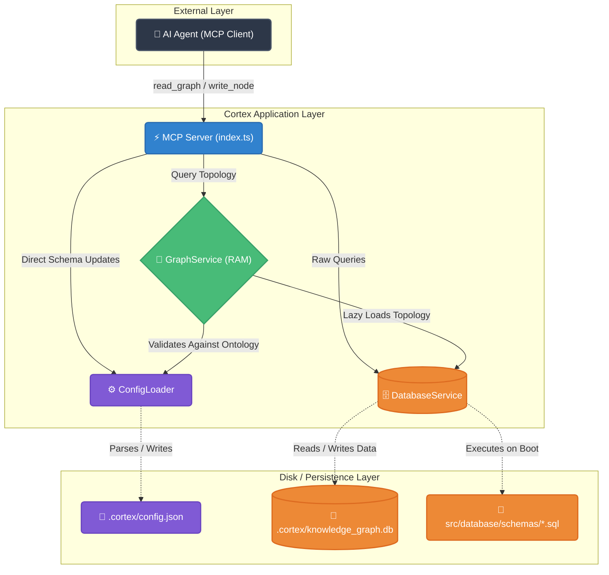
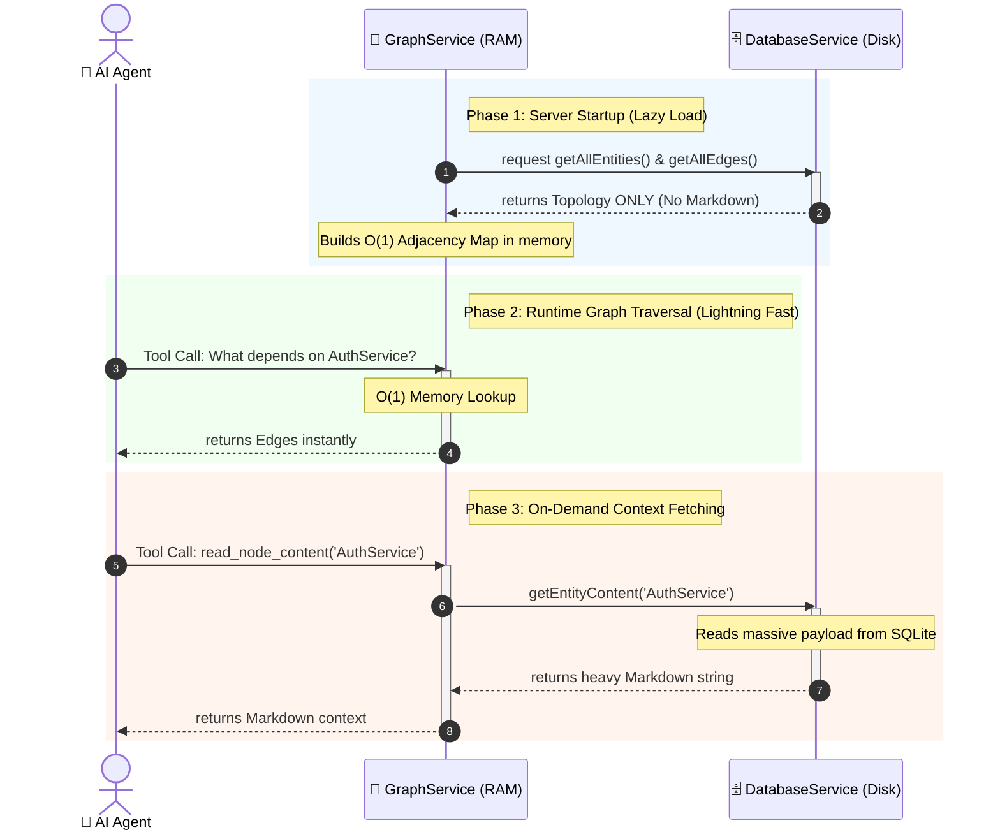

# Cortex Architecture

Cortex is designed as a strict, Domain-Driven, local Operating System for AI Agents. It enforces rules and mathematics on top of AI intuition, ensuring that architectural decisions and knowledge graphs are deterministic and free of "slop".

## 1. High-Level Architecture

The system is built on a heavily decoupled architecture consisting of independent services, orchestrated by an MCP Server.

---

## 2. The Three Pillars of the Core Engine

### A. The Config Loader (The Rule Enforcer)
The `ConfigLoader` is the global settings manager. It reads `.cortex/config.json` on startup. 
*   **Purpose:** It enforces the **Preset Ontology**. If an AI tries to create a node of type `RandomThing`, the Config Loader rejects it because it isn't in the allowed `entityTypes` array. 
*   **Fail-Fast:** If the JSON file is manually edited by a human and contains structural errors, the system intentionally crashes on startup to prevent data corruption.
*   **Write-Back:** When the AI autonomously decides to expand the ontology (e.g., adding `DatabaseTable`), the Config Loader instantly writes it back to the JSON file so the data is preserved on restart and can be committed to Git.

### B. The Database Service (The Vault)
Uses `better-sqlite3` for synchronous, lightning-fast C++ disk interactions.
*   **Multiple Schemas:** The database dynamically reads `.sql` files from the `schemas/` directory to build its tables. 
*   **Strict Integrity:** The `nodes` and `edges` tables use strict `FOREIGN KEY` constraints. It is physically impossible for the AI to draw an edge to a node that doesn't exist.
*   **Testability:** Because it's completely decoupled, unit tests can pass `':memory:'` to the constructor to spin up ephemeral, zero-IO databases that auto-delete after testing.

### C. The Graph Service (The Brain)
The orchestrator that acts as a Facade for the MCP server. It manages the in-memory graph.

---

## 3. The In-Memory Database Pattern

The true magic of Cortex lies in how it balances **Massive Context (Markdown)** with **Instant Graph Traversals**. It achieves this using the "Lazy-Loaded In-Memory Adjacency Map" pattern.

### How it works:
1.  **O(1) Adjacency Map:** On startup, the `GraphService` fetches all nodes and edges from SQLite and builds a `Map<string, Node>`. Each node contains arrays of its `incoming` and `outgoing` edges. When the AI wants the "blast radius" of a change, the Graph Service does a single `O(1)` memory lookup.
2.  **Lazy Loading:** The SQLite database contains massive strings of Markdown for each node. If we loaded 100,000 Markdown files into the RAM Map on startup, the server would crash. Instead, the `DatabaseService.getAllEntities()` method explicitly ignores the `content` column. 
3.  **On-Demand Fetching:** The heavy Markdown is only pulled from the hard drive when the AI explicitly invokes a `read_node_content` command.

This pattern allows Cortex to run locally on a developer's machine with an almost invisible memory footprint, while still providing instantaneous graph mathematics to the AI.
